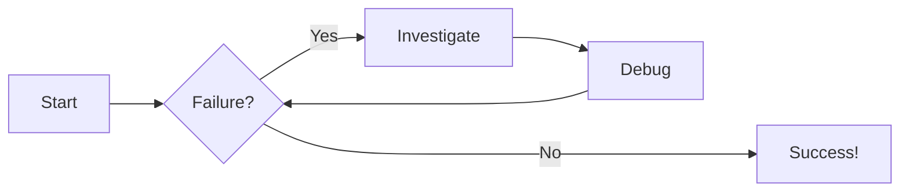
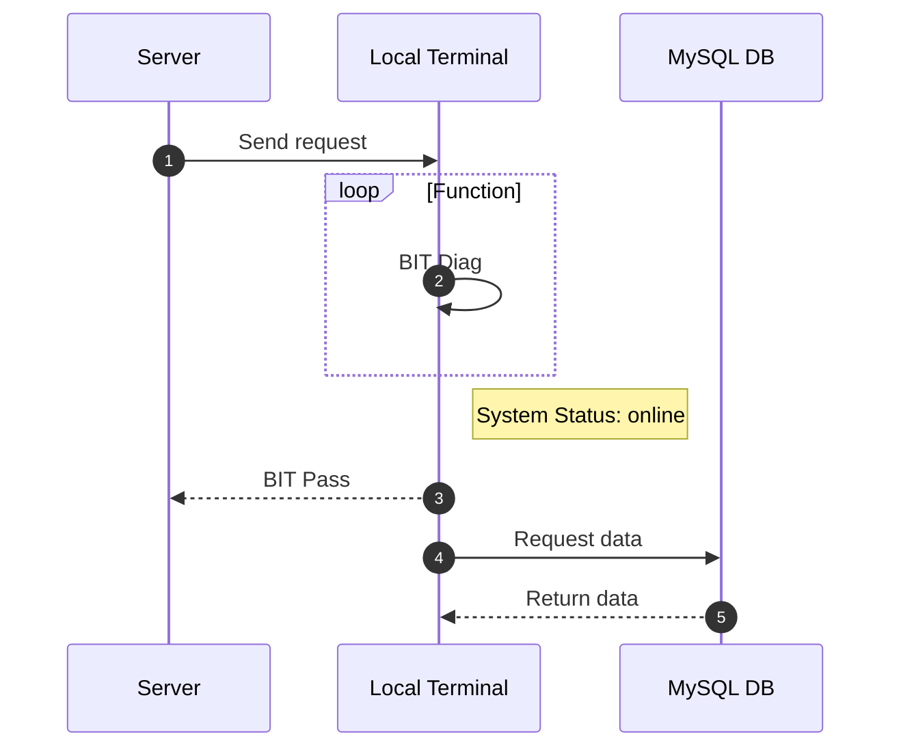

## <u>Content Tabs</u>
=== "Plain text"
    This is some plain text

=== "Unordered list"
    * First item
    * Second item
    * Third item

=== "Ordered list"
    1. First item
    2. Second item
    3. Third item
<hr>


## <u>Call-Outs</u>
!!! note "Note Call-Out"
    Example Call-Out Text

!!! info "info Call-Out"
    Example Call-Out Text

!!! example "Example Call-Out"
    Example Call-Out Text

!!! tip "Tip Call-Out"
    Example Call-Out Text

!!! question "Question Call-Out"
    Example Call-Out Text

!!! quote "Quote Call-Out"
    Example Call-Out Text

!!! abstract "Abstract Call-Out"
    Example Call-Out Text

!!! success "Success Call-Out"
    Example Call-Out Text

!!! failure "Failure Call-Out"
    Example Call-Out Text

!!! bug "Bug Call-Out"
    Example Call-Out Text

!!! warning "Warning Call-Out"
    Example Call-Out Text

!!! danger "Danger Call-Out"
    Example Call-Out Text

??? info "Collapsible Call-Out"
    Example Collapsible Call-Out Text

!!! info inline "Left-Aligned Inline Call-Out"
    Example Left-Aligned Inline Call-Out Text
Example Left-Aligned Inline Call-Out Text

<br>
<br>
<br>

!!! info inline end "Right-Aligned Inline Call-Out"
    Example Right-Aligned Inline Call-Out Text
Example Right-Aligned Inline Call-Out Text

<br>
<br>
<br>
<hr>

## <u>Code Blocks</u>
```py title="Syntax Highlighting"
# Function to add two numbers
def add_two_numbers(num1, num2):
    return num1 + num2

# Example usage
result = add_two_numbers(5, 3)
print('The sum is:', result)
```

```py title="Line Numbers" linenums="1"
# Function to add two numbers
def add_two_numbers(num1, num2):
    return num1 + num2

# Example usage
result = add_two_numbers(5, 3)
print('The sum is:', result)
```

```py title="Line Highlighting" linenums="1" hl_lines="2-4"
# Function to add two numbers
def add_two_numbers(num1, num2):
    return num1 + num2

# Example usage
result = add_two_numbers(5, 3)
print('The sum is:', result)
```

<hr>
# Diagrams

## Flowchart


## Sequence Diagram
